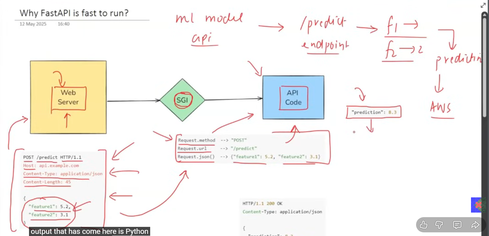
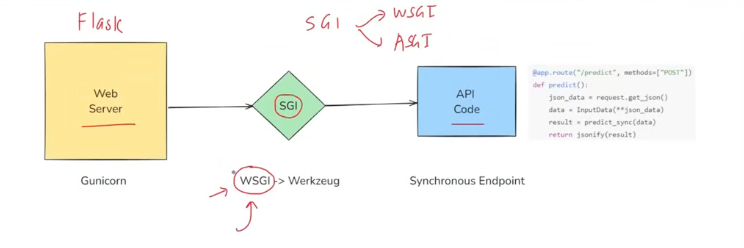

# FastAPI Philosophy | How to setup and use FastAPI

FAstAPI is a modern, fast (high-performance), web framework for building APIs with Python 3.7+ based on standard Python type hints. The key philosophies behind FastAPI are:
1. **Fast to code**: FastAPI is designed to be easy to use and learn, allowing developers to create APIs quickly. The use of Python type hints helps with code completion and reduces the amount of boilerplate code needed.
2. **High performance**: FastAPI is built on top of Starlette for the web parts and Pydantic for the data parts, which makes it one of the fastest Python frameworks available. It is designed to handle high loads and provide low latency responses.

Starlette manages how your api handles requests and responses, routing, middleware, and other web-related functionalities.

 Pydantic is used to check if rhe data sent to and from the API is valid and correctly formatted, based on the defined data models.

## WHy FASTAPI?

1. Fast to Run: 
2. Fast to Code:


---

## Fast ti Run



Assume there is a ML Model which takes some input and gives output after processing.

Usinf feature f1 adn f2 we can build a ML model to predict output.

So the web server will send a http request to the API with input features f1 and f2.

which looks like this:
```json
POST /predict HTTP/1.1
Host: api.example.com
Content-Type: application/json
Content-Length: ...
{
  "f1": value1,
  "f2": value2
} 
```


THis is a http request which our API cannot understand, so it uses SGI(Standard Gateway Interface) to convert this http request into a python object which can be understood by our ML model.

The ML model processes the input features and generates a prediction. 
It looks like this:
```python
{
  "prediction": predicted_value
}
```

The API then takes this prediction and converts it back into an HTTP response format using SGI.

The response looks like this:
```json
HTTP/1.1 200 OK
Content-Type: application/json
Content-Length: ...
{
  "prediction": predicted_value
}
```
This response is then sent back to the web server, which can then present the prediction to the user.

---

## Same Flow - How does it work in Flask?

SGI is of two types: WSGI(Web Server Gateway Interface) and ASGI(Asynchronous Server Gateway Interface).

Flask follows WSGI standard which is synchronous in nature.
This means that each request is handled one at a time, which can lead to delays if multiple requests are made simultaneously.



It happens serially, one after another. and uses blocking IO operations.

Wheareas FastAPI follows ASGI standard which is asynchronous in nature.
This means that multiple requests can be handled concurrently, allowing for better performance and responsiveness.

Flask uses a web server named Gunicorn to handle incoming requests, which then forwards them to the Flask application.

Wheareats, FastAPI uses an **ASGI server(Starlette)** named **Uvicorn** to handle incoming requests, which then forwards them to the FastAPI application.
Uvicorn is designed to take advantage of asynchronous programming, allowing it to handle multiple requests simultaneously without blocking.

## Why Fast to Code?

1. Automatic Input Validation: FastAPI automatically validates the input data based on the defined data models using Pydantic. This reduces the amount of code needed for validation and error handling.

2. Automatic Documentation: FastAPI automatically generates interactive API documentation using Swagger UI and ReDoc. This makes it easy for developers to explore and test the API without writing additional documentation.

Type /docs for Swagger UI and /redoc for ReDoc after the server is running.

3. Seamless Integration with Modern Ecosystem: ML,DL frameworks like TensorFlow, PyTorch, Scikit-learn can be easily integrated with FastAPI to deploy models as APIs,OAuth2, JWT authentication, CORS handling, and more are supported out of the box, Docker, Kubernetes support for containerization and orchestration.

---

## How to setup FastAPI?  

To set up FastAPI, follow these steps:

1. Setup Virtual Environment:
   It is recommended to create a virtual environment to manage your project dependencies. You can use `venv` or `virtualenv` for this purpose.

   ```bash
   python -m venv venv
   source venv/bin/activate  # On Windows, use `venv\Scripts\activate`
   ```

2. Install FastAPI and Uvicorn:
   You can install FastAPI and Uvicorn using pip:
    ```bash
    pip install fastapi uvicorn
    ```
3. Create a FastAPI Application:
   Create a new Python file (e.g., `main.py`) and add the following code to create a simple FastAPI application:

4. Run the Application:
   You can run the FastAPI application using Uvicorn with the following command:
   ```bash
   uvicorn main:app --reload
   ```
   The `--reload` flag enables auto-reloading of the server when code changes are detected.

