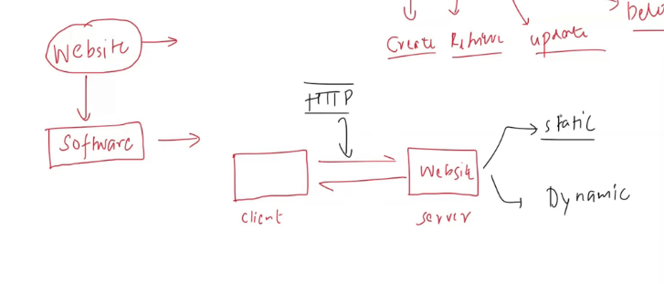

# HTTP Methods
HTTP methods are a set of request methods used in the Hypertext Transfer Protocol (HTTP) to indicate the desired action to be performed on a given resource. They are an essential part of RESTful APIs and web services, allowing clients to interact with servers in a standardized way.

The most commonly used HTTP methods include:
1. **GET**: The GET method is used to retrieve data from a server. It is a read-only operation and does not modify any resources. For example, fetching a list of users or retrieving a specific user's details.

    Example:
    ```http
    GET /users HTTP/1.1
    Host: api.example.com
    ```

2. **POST**: The POST method is used to send data to a server to create a new resource. It is commonly used for submitting forms or uploading files.

    Example:
    ```http
    POST /users HTTP/1.1
    Host: api.example.com
    Content-Type: application/json

    {
      "name": "John Doe",
      "email": "  
      "
    }

    ```
3. **PUT**: The PUT method is used to update an existing resource on the server. It replaces the entire resource with the data provided in the request.

----

wE ARE GOINT TO BUILD A IMPLE AI USING FASTAPI AND SEE HOW HTTP METHODS WORKS IN THE BACKEND.

Software is divided into two parts:
  1. Static: Calender isnt going to change everyday

  2. Dynamic: Weather is going to change everyday
    Whatever we do in CRUD operations we are dealing with dynamic data. 

    C-reate
    R-ead
    U-pdate
    D-elete


So whenever we are dealing with dynamic data we need to use HTTP methods to perform CRUD operations.


    Eg: In Zomato , we place an order( Create), we can see our order status ( Read), we can change our order ( Update), we can cancel our order ( Delete).

SO,
when we want to Create a resource we use **POST** method.
when we want to Read a resource we use **GET** method. 
when we want to Update a resource we use **PUT** method. 
when we want to Delete a resource we use **DELETE** method.

Check inspect tab in browser to see how these methods work in the backend.

