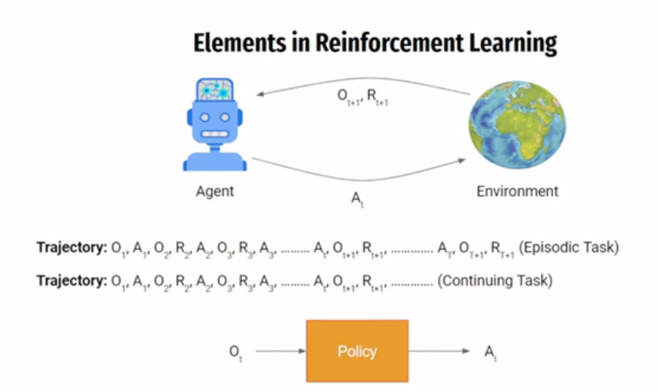
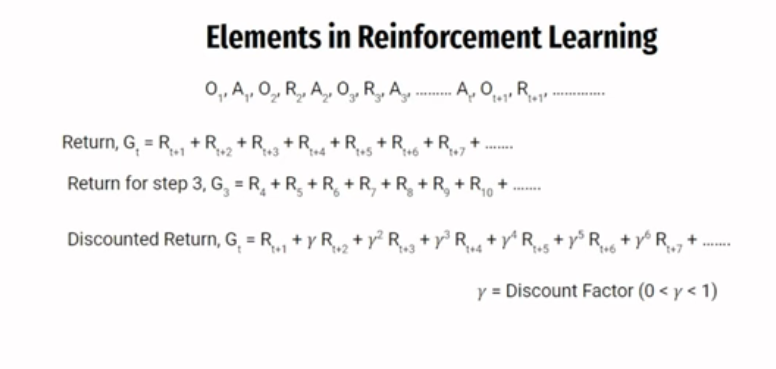
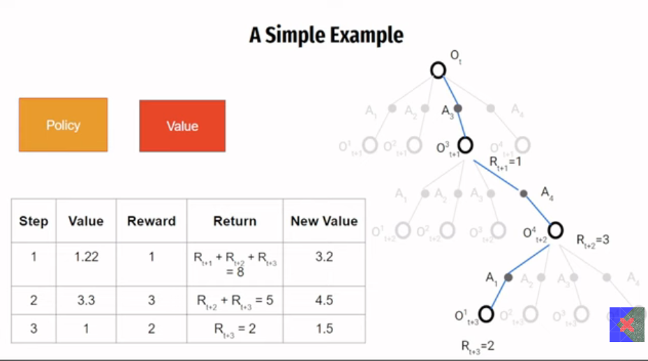
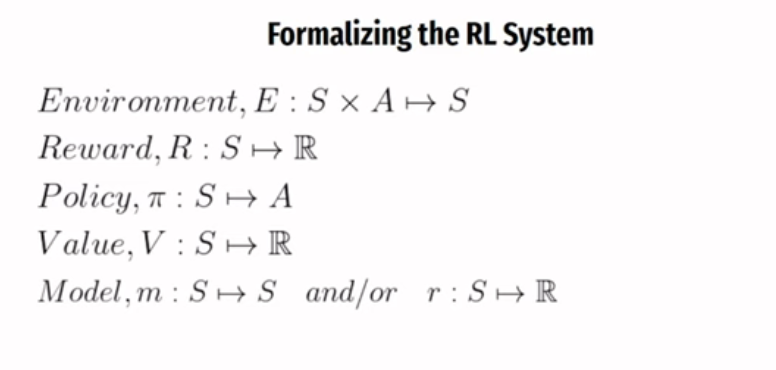

# What is reinforcement learning?

It is like teaching a dog new tricks. You give it a treat when it does something good, and you ignore or correct it when it does something bad. Over time, the dog learns to repeat the good behavior to get more treats.

In reinforcement learning, an agent learns to make decisions by taking actions in an environment to maximize some notion of cumulative reward. The agent receives feedback in the form of rewards or penalties based on its actions, and it uses this feedback to learn and improve its behavior over time.

# why is reinforcement learning important?

It is used in various applications, such as:
- Game playing (like AlphaGo)
- Robotics
- Autonomous vehicles
- Personalized recommendations

# ELements in reinforcement learning

1. **Agent**: The learner or decision-maker.
2. **Environment**: The external system the agent interacts with.

Trajectory: A sequence of states, actions, and rewards that the agent experiences over time.
3. **State (s)**: A representation of the current situation of the agent in the environment.
4. **Action (a)**: The choices available to the agent at each state.

# Components of reinforcement learning

1. Environment: The world in which the agent operates. For eg: in a game, the environment would be the game itself.
 
 E = S x A -> State space x Action space 

2. Reward Signal: A scalar value that indicates how good or bad the agent's action was in a particular state. The goal of the agent is to maximize the cumulative reward over time.

For eg: +1 for winning a game, -1 for losing a game.

S x A -> R  (State x Action -> Reward)

3. Policy(π): A strategy that the agent uses to decide which action to take in a given state. It can be deterministic (a specific action for each state) or stochastic (a probability distribution over actions for each state).

for eg: An example for deterministic policy could be: "If the state is S1, take action A1; if the state is S2, take action A2."

Whereas, a stochastic policy could be: "If the state is S1, take action A1 with probability 0.7 and action A2 with probability 0.3."at is the difference between deterministic and stochastic policy?

4. Value Function (V): A function that estimates the expected cumulative reward that an agent can obtain from a given state (or state-action pair) by following a particular policy.

For eg: V(s) = expected cumulative reward starting from state s and following policy π.

 V : S -> R  (State -> Reward)

5. Model (m): A representation of the environment that the agent can use to predict the next state and reward given the current state and action. Not all reinforcement learning algorithms use a model; those that do are called model-based, while those that don't are called model-free.

For eg: A model could be a set of equations or a neural network that predicts the next state and reward based on the current state and action.

 m : S x A -> S x R  (State x Action -> State x Reward)