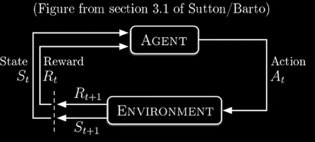
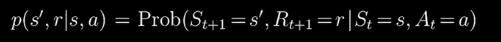

# Reinforcement Learning, by the Book

An agent (that which learns and takes actions) A-t(ACTION at time t) by the environment (that which interacts with the agent) E-t(ENVIRONMENT at time t) in a state S-t(STATE at time t) receives a reward R-t(REWARD at time t) and transitions to a new state S-(t+1)(STATE at time t+1).

Time is discrete and proceeds in steps t = 0, 1, 2, ...

state s-t ∈ S(SET OF ALL POSSIBLE STATES) where s belongs to S(state space)
action a-t ∈ A(SET OF ALL POSSIBLE ACTIONS) where a belongs to A(action space)
reward r-t ∈ R(SET OF ALL POSSIBLE REWARDS) where r belongs to R(reward space) = -1, 0, +1

This is the formula we use to calculate.
what we learn from this formila is that, the next state S-(t+1) only depends on the current state S-t and the action A-t taken at that state & not on any of the previous states or actions( historic data).
This is called the MARKOV PROPERTY.

 A policy π is a mapping from states to probabilities of selecting each possible action.

 

 for S=s1, the agent will choose action a1 with probability 0.2, action a2 with probability 0.7, and action a3 with probability 0.1.
 but for S=s2, the agent will always choose action a3 with probability 1.0.

 